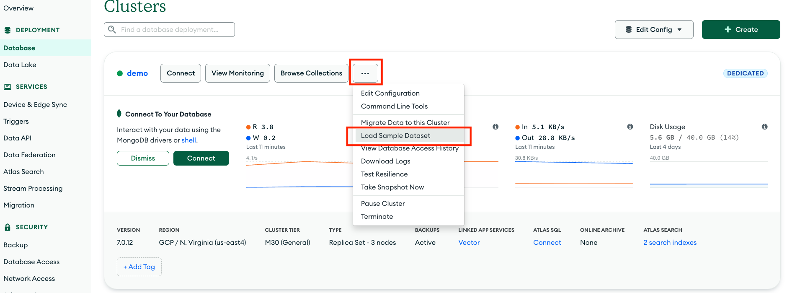
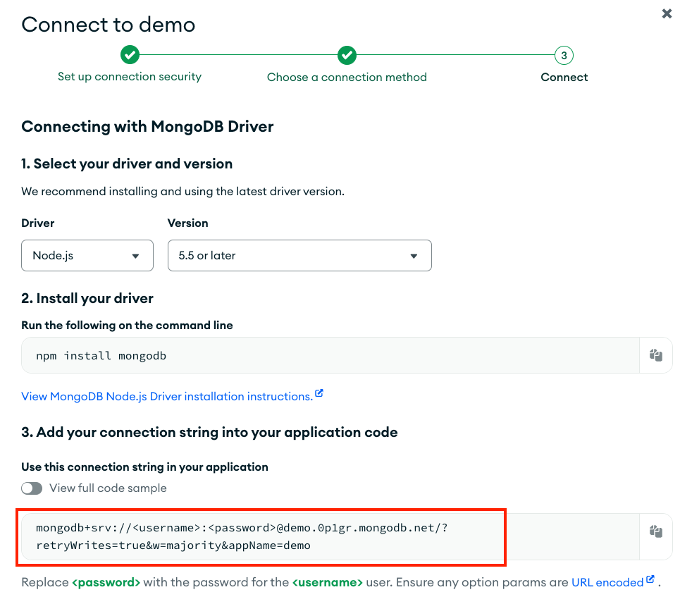
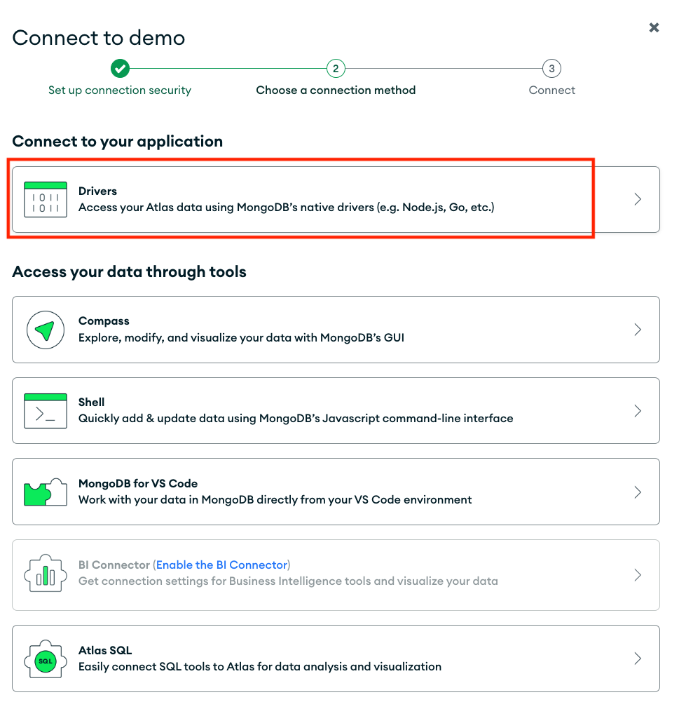

# Movie Search

This movie search application allows you to search lightning fast through a wide variety of data types through the sample_mflix.movies dataset offered free to download on MongoDB Atlas.

## Prequisites
### Create Cluster 
- Create a MongoDB Atlas account at https://cloud.mongodb.com
- Create an Atlas Cluster
  - Cloud Provider: AWS
  - Region: us-east-1
  - Cluster Tier: M10
  - Storage: 40 GB
  - Cluster Name: demo
 
### Create Database User
- Navigate to Database Access
- Create a database user
  - username: demo
  - password: demo
    
### Configure Network Access
- Navigate to Network Access
- Select Add IP Address
- Select "Allow Access from Anywhere"

### Load Sample Data
Select ... and "Load Sample Dataset
  

### Get Atlas Connection String

This will be the MongoDB Atlas Connection String. Replace username / password with demo / demo.
